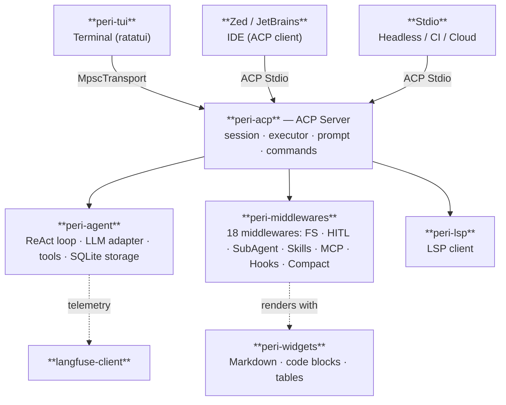

<div align="center">

# Peri Code

**A Rust-built coding agent — fast, lean, Claude Code compatible, any LLM.**

[](https://opensource.org/licenses/Apache-2.0)
[](https://www.rust-lang.org/)
[](#install)
[](#why-peri)
[](https://github.com/konghayao/peri)

</div>

One **13 MB binary**, **~50 MB of RAM**, **98% cache hits**. Bring your own API key — DeepSeek, GLM, Qwen, or Anthropic, switch on the fly. Your existing Claude Code config works today, not eventually: skills, hooks, MCP, plugins, sub-agents. **Zero migration, zero lock-in.**

99% of the codebase was written by AI (DeepSeek & GLM-5.2), shipped by humans who decided *what* to build. The agent files its own bugs, fixes them, and writes the lessons back into the repo. More on that [below](#built-by-ai-published-by-human).

---

## Why Peri

- 🦀 **Rust, not Node.js**
  - 13 MB binary, ~50 MB RAM. Won't sneak up to 1 GB while you're not looking
- ⚡ **95–99% cache hit rate**
  - Frozen system prompt + boundary marker = near-zero wasted tokens
- 🌐 **Any LLM**
  - Anthropic, OpenAI, DeepSeek, GLM, Qwen. Swap mid-session, no restart
- 🔌 **Drop-in Claude Code compatible**
  - Existing Claude Code config just works. Skills, hooks, MCP, plugins — zero migration
- 🔍 **Tool Search**
  - The LLM only sees what it needs. ~14 core tools, rest discovered on demand — lean prompts, fat cache hits
- 📝 **Streaming Markdown**
  - Code blocks, tables, diffs — fully rendered as the agent types, not after
- 🤖 **Sub-agents & background agents**
  - 7 built-in specialists (coder, explorer, code-reviewer, web-researcher…). Fork work to the background and keep going
- 🗜️ **Auto Compact**
  - Hours-long sessions stay fast and cheap, automatically
- 📦 **agm**
  - `agm install` any skill or agent. One lockfile, any tool
- 🔧 **Built-in LSP & observability**
  - Language-aware intelligence out of the box. Langfuse traces, token usage, cache monitor

---

## Architecture

Peri is not just a TUI. It's a layered platform where the **agent core** is decoupled from the **frontend** via the [Agent Client Protocol](https://agentclientprotocol.com). The same core powers three entry points:



**One core, three frontends.** Terminal users get `peri-tui`. IDE users connect via ACP (Zed today, more to come). Headless / CI / cloud scenarios use the Stdio transport. Change the agent logic once — every frontend benefits.

---

## Install

Binaries available for macOS (x86_64 / Apple Silicon), Linux (x86_64 / aarch64 / riscv64), and Windows (x86_64).

```bash
# macOS / Linux
curl -fsSL https://raw.githubusercontent.com/konghayao/peri/main/scripts/install.sh | bash

# Windows (PowerShell)
irm https://raw.githubusercontent.com/konghayao/peri/main/scripts/install.ps1 | iex

# start peri
peri

# self-update
peri update
```

First launch guides you through model and API key configuration — no config file editing required.

---

## Built by AI, Published by Human

Peri's code is 99% AI-generated, primarily by DeepSeek and GLM-5.2. The development workflow is a closed loop the agent drives itself:

| When you... | The loop kicks off |
|---|---|
| **Find a bug or tech debt** | `issue-create` → `systematic-debugging` → `writing-plans` → `subagent-driven-development` → `issue-archive` → update `CLAUDE.md` |
| **Want a new feature** | `grill-me` → `writing-plans` → `subagent-driven-development` |
| **Codebase getting messy** | `slop-cleaner` → `improve-codebase-architecture` → `writing-plans` → `subagent-driven-development` |

Each fix that reveals a non-obvious constraint gets written back into `CLAUDE.md` as a **TRAP** — a hard rule the agent follows on every subsequent iteration. The dozens of TRAPs in the repo weren't authored by humans; they were extracted by the agent at the scene of each bug. That's how quality compounds without human code review.

→ Read the full story: [Nobody Coding](docs/blogs/ai-coding-paradigm/nobody-coding.md)

---

## Acknowledgments

- [Claude Code Best](https://github.com/claude-code-best/claude-code) — community support and feedback
- [Superpowers](https://github.com/obra/superpowers) & [Matt Pocock's Skills](https://github.com/mattpocock/skills) — the skill suites that drive Peri's AI engineering workflow
- [ACP](https://agentclientprotocol.com) — open protocol for agent-IDE communication
- [rmcp](https://github.com/anthropics/rmcp) — Rust MCP client library
- [Ratatui](https://ratatui.rs) & [Tokio](https://tokio.rs)
- [Langfuse](https://langfuse.com) — LLM observability
- [Zed](https://zed.dev) — first ACP-compatible IDE

## License

Apache 2.0
